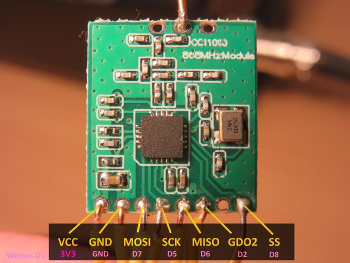

# Easy-ESP-IoT-Arduino-CC1101-LORA

This is an easy to use Arduino CC1101 library (working example) to be able to connect a [Texas Instruments CC1101](http://www.ti.com/product/CC1101) to a ESP32 or ESP8266.

# Buying a CC1101

CC1101 modules can be bought [for a few bucks](https://www.aliexpress.com/item/CC1101-Wireless-Module-Long-Distance-Transmission-Antenna-868MHZ-M115/32635393463.html).

# Using a CC1101

Whilst the CC1101 is almost a 10 year old device, it is used is MANY low power or long life battery operated devices to transmit data. Given these transceivers work on the low frequency ISM bands (433, 868, 915 etc.), signals can travel a fair distance. The CC1101 is still technically superior to the often mentioned LoRA / Semtech chip technology.

Whilst the CC1101 has some [show stopper bugs](http://www.ti.com/lit/er/swrz020e/swrz020e.pdf) this Arduino library aggressively works around these issues and as a result is VERY reliable with continuous send and receive operation. 

This library supports sending large strings/streams of data, using multiple 61 byte radio packets (that's the CC1101's underlying fixed radio packet size). However, using this functionality increases the risk of lost data - so your own packet/message acknowledgement code would be required. 

# Installation

Pull this repository, and load the .ino file onto two ESP8266 devices with the opposite sending/receiving addresses configured (refer to the sketch code).

# Connecting your ESP 8266 / ESP 8266

Use the standard SPI ports to connect to the 8 pins on the CC1101 module. For example, with the Wemos D1 Mini (ESP8266 Chip), it's easy as:

